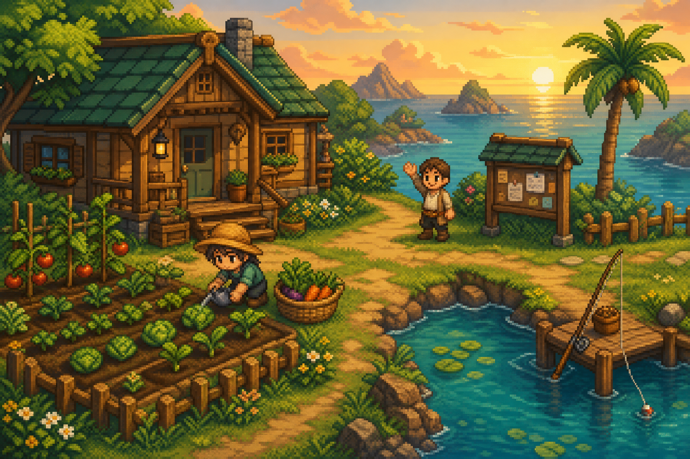
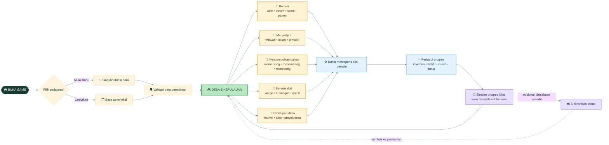
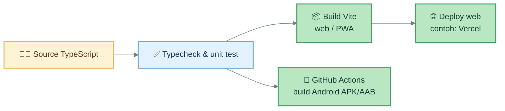

# TIRTAWANA — Papan Workflow

> Peta visual perjalanan pemain dan aliran sistem untuk **Tirtawana: The Living Isles**, game 2D pixel-art tentang bertani, kehidupan desa, dan eksplorasi kepulauan.

*Ilustrasi suasana untuk dokumen ini—bukan tangkapan layar gameplay.*

## 1. Alur pemain — dari masuk sampai lanjut bermain

**Cara membaca:** pemain memilih mulai baru atau melanjutkan save. Setelah data disiapkan, pemain bebas berpindah di antara aktivitas pulau. Aksi memperbarui keadaan dunia dan progres disimpan lokal agar permainan dapat dilanjutkan. Sinkronisasi Supabase bersifat opsional; permainan tidak bergantung pada login cloud.

## 2. Peta sistem — kartu kode yang saling terhubung

```mermaid
%%{init: {"theme":"base","themeVariables":{"fontFamily":"Inter, ui-sans-serif, sans-serif","lineColor":"#66877a","primaryTextColor":"#173c32","clusterBkg":"#f3f7ef","clusterBorder":"#d7e4d3"}}}%%
flowchart LR
  PLAYER[🕹️ Input pemain<br/>joystick • keyboard • tombol aksi] --> GAME[🎬 Phaser scenes<br/>GameScene & antarmuka]
  GAME --> SYSTEMS[🧩 Sistem permainan<br/>farming • inventory • waktu/cuaca<br/>quest • relasi • ekonomi • hewan]
  SYSTEMS --> WORLD[🗺️ Keadaan dunia<br/>wilayah • kebun • warga • progres]
  WORLD --> SAVE[💾 SaveManager]
  SAVE --> VALIDATE[🛡️ SaveValidator<br/>periksa & pulihkan data]
  VALIDATE --> LOCAL[(📦 IndexedDB<br/>penyimpanan perangkat)]
  SAVE -. "jika dikonfigurasi" .-> SYNC[🔄 SyncManager]
  SYNC -. "opsional" .-> SUPA[(☁️ Supabase)]
  LOCAL --> RESUME[▶️ Muat permainan berikutnya]
  RESUME --> GAME

  classDef input fill:#fff3d6,color:#593e1d,stroke:#e1b96a,stroke-width:2px;
  classDef app fill:#b9e7c2,color:#173c32,stroke:#4b9b69,stroke-width:2px;
  classDef state fill:#e4f1ff,color:#173c56,stroke:#77a9d0,stroke-width:2px;
  classDef storage fill:#e8e0ff,color:#342954,stroke:#9a82d2,stroke-width:2px;
  class PLAYER input;
  class GAME,SYSTEMS app;
  class WORLD,VALIDATE state;
  class SAVE,LOCAL,SYNC,SUPA,RESUME storage;
```

## 3. Build dan distribusi

## Ringkasan kartu

| Bagian | Peran dalam workflow |
|---|---|
| **Game scenes** | Menampilkan dunia dan menerima aksi pemain melalui Phaser. |
| **Sistem permainan** | Mengelola kegiatan seperti bertani, inventori, waktu, cuaca, quest, relasi, dan ekonomi. |
| **Save lokal** | Menyimpan progres di perangkat melalui IndexedDB; data divalidasi sebelum digunakan. |
| **Cloud opsional** | Supabase dapat dipakai untuk sinkronisasi jika kredensial tersedia; game tetap bisa dimainkan tanpa layanan tersebut. |
| **Build** | Typecheck dan pengujian memeriksa source sebelum build web/PWA atau workflow Android. |

## Sumber di repositori

Gambaran fitur dan cara menjalankan proyek mengikuti README [1]. Alur penyimpanan merujuk pada implementasi SaveManager, SaveValidator, adapter IndexedDB, serta SyncManager [2] [3] [4] [5]. Jalur build Android dan web mengacu pada workflow CI yang ada [6] [7].

[1]: ../README.md "README Tirtawana"
[2]: ../src/save/SaveManager.ts "SaveManager"
[3]: ../src/save/SaveValidator.ts "SaveValidator"
[4]: ../src/save/IndexedDBAdapter.ts "IndexedDB adapter"
[5]: ../src/save/SyncManager.ts "SyncManager"
[6]: ../.github/workflows/android.yml "Android GitHub Actions workflow"
[7]: ../.github/workflows/build.yml "Build GitHub Actions workflow"
